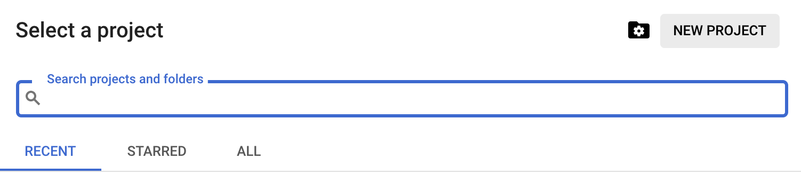
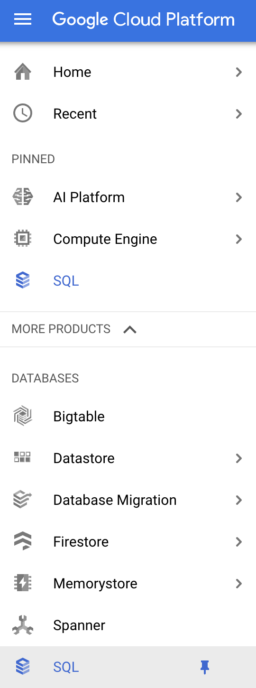
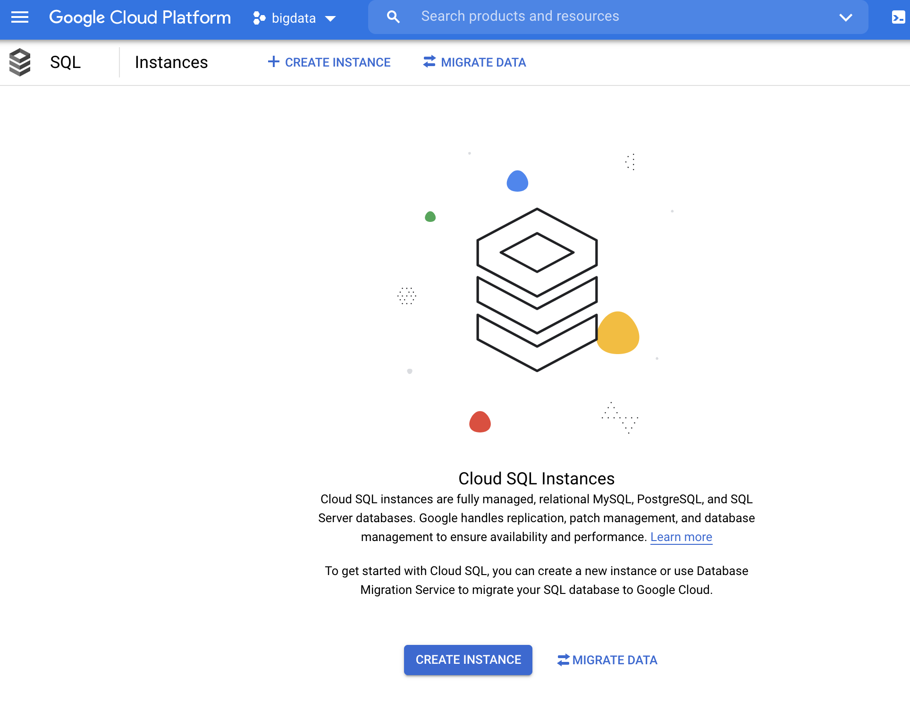
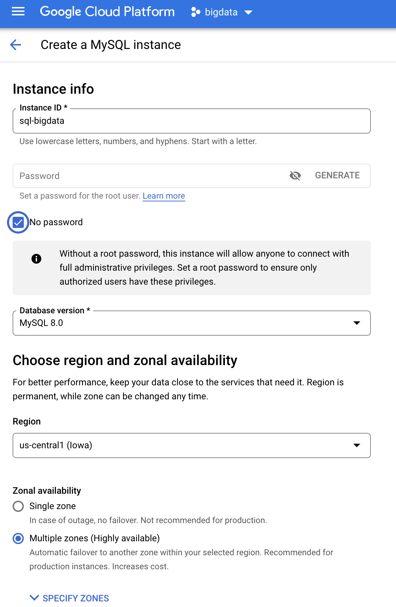
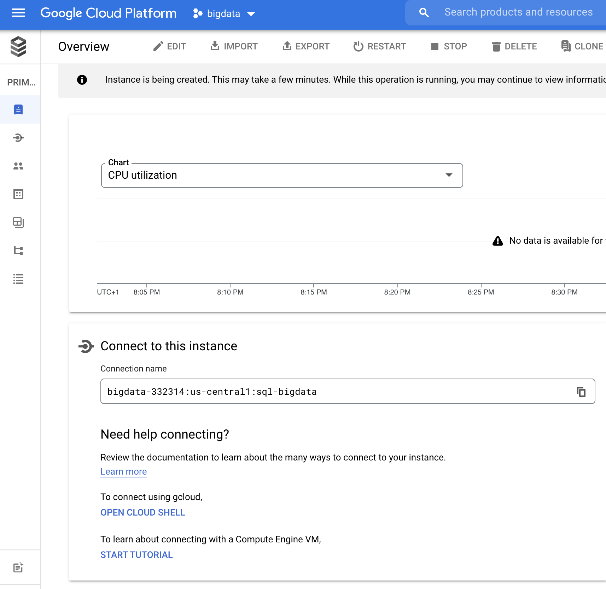
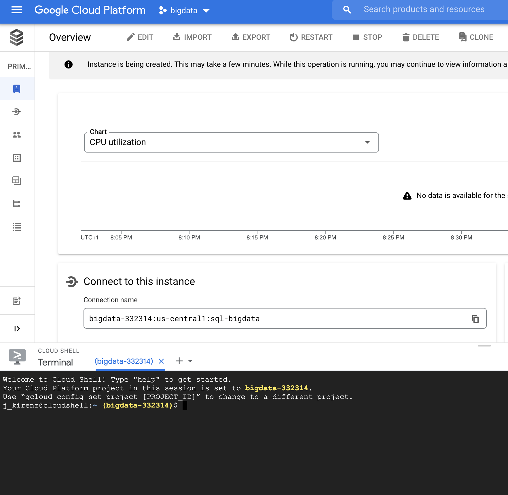
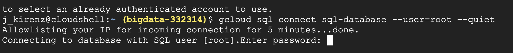
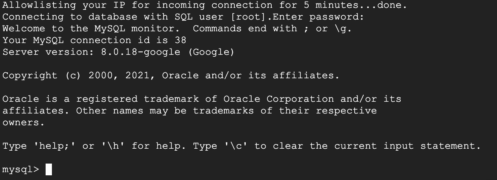

author: Jan Kirenz
summary: Create a relational database in Google Cloud and connect it to Google Datastudio
id: cloud-mysql
tags:
categories:
environments: Web
status: Published
feedback link: https://github.com/kirenz/codelabs/blob/master/markdown/cloud-mysql

# Relational database in Google Cloud

<!-- ------------------------ -->
## Overview

Duration: 0:02:00

In this tutorial you learn how to create a SQL database (using [MySQL](https://www.mysql.com)) in Google Cloud hand how to connect the database with [Google Datastudio](https://datastudio.google.com). 

<aside class="positive">
You need a Google Cloud account for this tutorial 
</aside>


### What we cover

- Create a SQL database in Google Cloud
- Use the SQL server with cloud shell
- Create a database and insert data
- Connect the database with Google Datastudio 
- Create a report in Google Datastudio


<!-- ------------------------ -->
## Prerequisites

Duration: 0:01:00

To start this tutorial, you need the following setup:

- Access to Google Cloud (you may use the teaching credits or the [90-day, $300 Free Trial](https://cloud.google.com/free/docs/gcp-free-tier)).
- [Google account](myaccount.google.com) to access Google Datastudio

<!-- ------------------------ -->
## Create a project

Duration: 0:02:00

First you need to create a new project in Google Cloud:

1. Go to the [Google Cloud console](https://console.cloud.google.com) and log in with your account.

2. At the top of the menu, click on the "project selection" button between Google Cloud Platform and the search field.


3. Click on "NEW PROJECT" and call it "bigdata"



4. In the project selection, choose your project "bigdata"

<!-- ------------------------ -->
## Activate Cloud SQL Admin API

Duration: 0:02:00

1. Go to the search field at the top of the page and enter "Cloud SQL Admin API". Select the Cloud SQL Admin API:


1. Enable the API


<!-- ------------------------ -->
## Create SQL database

Duration: 0:05:00


1. Click on the navigation menu on the left

1. Under "DATABASES" select "SQL"




1. Click on "Create Instance"




1. Choose MySQL


1. Probably you need to enable the API first. Click on "Enable API"  


1. Provide the following information and click on "CREATE INSTANCE":

Note: We won't use a password to make the following steps easier. However, in real projects you should alwas use a strong password.

- Instance ID: sql-database
- Password: Select no password 
- Database version: MySQL 8.0
- Region: us-central (Iowa)
- Zonal availability: Multiple zones




<!-- ------------------------ -->
## SQL cloud shell

Duration: 0:05:00

1. You should see the following overview



1. In the window "Connect to this instance", click on "OPEN CLOUD SHELL" to connect. This will open a terminal at the bottom of the page:




1. In the terminal, the following code should be already visible:

```bash
gcloud sql connect sql-database --user=root --quiet
```

1. Navigate in the terminal and press enter.


1. Now you should see a pop-up window. Authorize cloud shell: 


1. Optional: If you don't click on the authorization immediately, you may get a error message. In that case, first authorize the cloud shell and again enter `gcloud sql connect sql-database --user=root --quiet`in the terminal.


1. Next you need to enter the password. Since we choose to use no password, you only need to press enter.



1. You should see the following screen:




<!-- ------------------------ -->
## Create a database

Duration: 0:05:00


1. Next, we use SQL to create a database. We call it `mydatabase`

```bash
CREATE DATABASE mydatabase;
```

1. Switch to the database by entering the following command into the shell:

```bash
USE mydatabase;
```


Txt

<!-- ------------------------ -->
## What's next?

Duration: 0:02:00

Congratulations! You have completed the tutorial and learned how to:

✅ Install  
✅ Use  
✅ Implement  

Next, you may want to proceed with this tutorial:

- 💻[](https://kirenz.github.io/codelabs/codelabs/cloud-mysql


Thank you for participating in this tutorial. If you found any issues along the way I'd appreciate it if you'd raise them by clicking the "Report a mistake" button at the bottom left of this site.

*Copyright: Jan Kirenz (2021) | [kirenz.com](https://www.kirenz.com) | [CC BY-NC 2.0 License](https://creativecommons.org/licenses/by-nc/2.0/)*