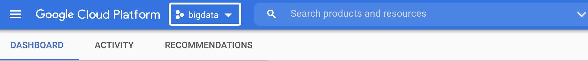

author: Jan Kirenz
summary: Create a relational database in Google Cloud and connect it to Google Datastudio
id: cloud-mysql
tags:
categories:
environments: Web
status: Published
feedback link: https://github.com/kirenz/codelabs/blob/master/markdown/cloud-mysql

# Relational database in Google Cloud

<!-- ------------------------ -->
## Overview

Duration: 0:02:00

In this tutorial you learn how to create a SQL database (using [MySQL](https://www.mysql.com)) in Google Cloud and how to create a database and table. 

<aside class="positive">
You need a Google Cloud account for this tutorial 
</aside>


### What we cover

- Create a SQL database in Google Cloud
- Use the SQL server with cloud shell
- Use SQL to create a database and a table


<!-- ------------------------ -->
## Prerequisites

Duration: 0:01:00

To start this tutorial, you need the following setup:

- Access to Google Cloud (you may use the teaching credits or the [90-day, $300 Free Trial](https://cloud.google.com/free/docs/gcp-free-tier)).

<!-- ------------------------ -->
## Create a project

Duration: 0:02:00

First you need to create a new project in Google Cloud:

1. Go to the [Google Cloud console](https://console.cloud.google.com) and log in with your account.

1. At the left side at the top of the menu, click on the "project selection" button (located between "Google Cloud Platform" and the search field).



1. Click on "NEW PROJECT" and call it "bigdata"


1. In the project selection, choose your project "bigdata"

<!-- ------------------------ -->
## Activate Cloud SQL Admin API

Duration: 0:01:00

1. Go to the search field at the top of the page and enter "Cloud SQL Admin API". Select the Cloud SQL Admin API from the marketplace:


1. Enable the API:


<!-- ------------------------ -->
## Create a SQL database

Duration: 0:05:00

1. Click on the navigation menu on the left side at the top of the page

1. Under "DATABASES" select "SQL"


1. Click on "Create Instance"


1. Choose MySQL


1. If this is the first time that you create a SQL database in Google Cloud, you need to enable the API. Click on "Enable API"  


1. Provide the following information and click on "CREATE INSTANCE":

Note: We won't use a password to make the following steps easier. However, in real projects you should always use a strong password.

- Instance ID: sql-database
- Password: "Select no password at the checkbox" 
- Database version: MySQL 8.0
- Region: us-central (Iowa)
- Zonal availability: Multiple zones


<aside class="positive">
If you want lo learn more about advanced options if you create an instance, visit this [documentation](https://cloud.google.com/sql/docs/mysql/create-instance).
</aside>

<!-- ------------------------ -->
## SQL cloud shell

Duration: 0:05:00

1. You should see the following overview:


1. In the window "Connect to this instance", click on "OPEN CLOUD SHELL" to connect. This will open a black terminal at the bottom of the page:


1. In the terminal, the following code should be already visible (visit this [documentation](https://cloud.google.com/sdk/gcloud/reference/sql/connect) to learn more):

```bash
gcloud sql connect sql-database --user=root --quiet
```

1. Navigate inside the terminal and press enter.


1. Now you should see a pop-up window. Authorize cloud shell: 


1. Optional: If you don't click on the authorization immediately, you may get a error message. In that case, first authorize the cloud shell and again enter `gcloud sql connect sql-database --user=root --quiet` in the terminal. If you still get an error, check the hints at the end of this section.


1. Next you need to enter the password. Since we choose to use no password, you only need to press enter.


1. You should see the following screen:


<aside class="negative">
Note: If you should have troubles to connect to your database, make sure you have the Cloud SQL Admin and Compute Viewer roles on your user account. In Google Cloud, navigate to the [identity and access management (IAM) page](https://console.cloud.google.com/iam-admin/iam?_ga=2.188518954.367718554.1637234253-833492673.1631961616&_gac=1.24091080.1637070889.Cj0KCQiAys2MBhDOARIsAFf1D1faRohOXdVaN5UQ-cMaSMy0OK75I2zeKTvDGykdbfS7bYbq69hUsmwaAvZPEALw_wcB). For more information regarding IAM, visit this [site](https://cloud.google.com/sql/docs/mysql/create-instance).
</aside>

<!-- ------------------------ -->
## Create database and table

Duration: 0:05:00

In this section we use SQL code to create a database and table. You can copy the code and paste it into the shell window.

1. Next, we use SQL to create a database. We call it `mydatabase`

```sql
CREATE DATABASE mydatabase;
```

1. Switch to the database by entering the following command into the shell:

```sql
USE mydatabase;
```

1. Create a table inside the database. We call the table "teachers"

```sql
CREATE TABLE teachers (
    id serial,
    first_name varchar(25),
    last_name varchar(50),
    school varchar(50),
    hire_date date,
    salary numeric
    );
```

1. Insert values in the table:

```sql
INSERT INTO teachers (first_name, last_name, school, hire_date, salary)
VALUES ('Janet', 'Smith', 'F.D. Roosevelt HS', '2011-10-30', 36200), 
       ('Lee', 'Reynolds', 'F.D. Roosevelt HS', '1993-05-22', 65000),
       ('Samuel', 'Cole', 'Myers Middle School', '2005-08-01', 43500),
       ('Samantha', 'Bush', 'Myers Middle School', '2011-10-30', 36200),
       ('Betty', 'Diaz', 'Myers Middle School', '2005-08-30', 43500),
       ('Kathleen', 'Roush', 'F.D. Roosevelt HS', '2010-10-22',38500 );
```

1. Make a SQL-query to select all content from the table:

```sql
SELECT *
FROM mydatabase.teachers;
```


<!-- ------------------------ -->
## Stop SQL database 

Duration: 0:01:00

Since you pay your Cloud database by use, it makes sense to stop the instance if you don't need it anymore.

Review [this site](https://cloud.google.com/sql/pricing#mysql-pg-pricing) if you want to learn more about the pricing for SQL databases in Google Cloud.

1. Move to the top of the page in the SQL overview page and click on STOP 


<aside class="positive">
If you need the database at a later point in time, you can start it again.
</aside>


<!-- ------------------------ -->
## What's next?

Duration: 0:02:00

Congratulations! You have completed the tutorial and learned how to:

✅ Create a project in Google Cloud  
✅ Set up a Cloud SQL database  
✅ Use the cloud shell and SQL to create a database and table


Thank you for participating in this tutorial. If you found any issues along the way I'd appreciate it if you'd raise them by clicking the "Report a mistake" button at the bottom left of this site.

*Copyright: Jan Kirenz (2021) | [kirenz.com](https://www.kirenz.com) | [CC BY-NC 2.0 License](https://creativecommons.org/licenses/by-nc/2.0/)*