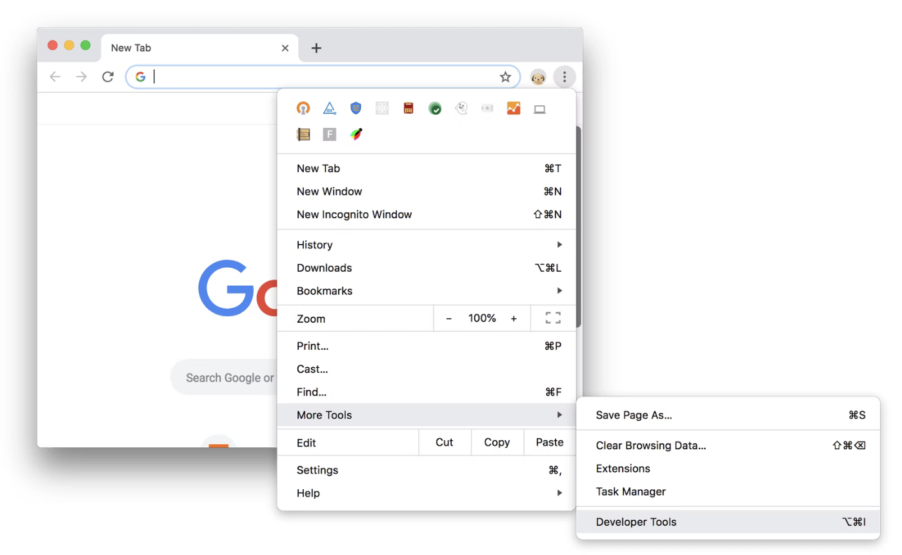

author: Jan Kirenz
summary:
id: webscraping
tags:
categories:
environments: Web
status: Published
feedback link: https://github.com/kirenz/codelabs/blob/master/markdown/webscraping

# Web Scraping Basics

<!-- ------------------------ -->
## Overview

Duration: 0:05:00

### What we cover

In this tutorial we cover the basics of web scraping (also called web harvesting, or web data extraction).

We will cover:

- Basics of HTML
- CSS Syntax and selectors
- Chrome DevTools 
- SelectorGadget

*The content about HTML and CSS selesctors is mainly based on Dmytro Perepolkin's ["Introduction to HTML elements"](https://rvest.tidyverse.org/articles/harvesting-the-web.html)*

<!-- ------------------------ -->
## Prerequisites

Duration: 0:01:00

To start this tutorial, you need:

- A [Google Chrome Web-Browser](https://www.google.com/intl/de_de/chrome/)

<!-- ------------------------ -->
## HTML  

Duration: 0:10:00

Watch this short video from w3schools which covers the basics of "Hyper Text Markup Language" (HTML): 

<video id="ewZ_YWbIWXI"></video>

### HTML page

- A HTML page consists of a series of *elements* which browsers use to interpret how to display the content. Below is a visualization of a simple HTML page structure:

### HTML tags

- HTML tags are names of the *elements* surrounded by angle brackets `< >`. 

- For example, the \<h1\> tag defines the most important heading:  

  - \<h1\> This is my most important heading \</h1\>

 
- Most HTML tags come in pairs and consist of opening and a closing tag, known as **start tag** and **end tag**, where the end tag name is preceded by the forward slash `/`.

### HTML attributes

- It is also possible to define HTML attributes inside HTML tags. 

- They provide additional information about HTML elements, such as   
  - hyperlinks for text, 
  - width and height for images

- Attributes are always defined in the start tag and come in name="value" pairs

- For example, the \<a\> tag defines a hyperlink, which is used to link from one page to another. 

- The most important attribute of the \<a\> element is the href attribute, which indicates the link's destination: 

  - \<a href="https://www.example.com"\>  Here is my anchor text \</a\>

*You can learn more about HTML tags and attributes from online resources, such as [W3schools](https://www.w3schools.com/html/default.asp)*

<!-- ------------------------ -->
## CSS 

Duration: 0:10:00

### Syntax

Watch this short video tutorial about the Cascading Style Sheets (CSS) Syntax:

<video id="QqmCs2UTS8s"></video>

- CSS is the language we use to style an HTML document

- CSS describes how HTML elements should be displayed

### CSS Selectors

- CSS selectors represent patterns for locating HTML elements 

- They can be used not only for styling, but also for extracting the content of these elements

- Try to solve the first 4 tasks in this [CSS selector game](https://flukeout.github.io/)

<!-- ------------------------ -->
## Chrome DevTools 

Duration: 0:05:00

Learn the basics of viewing a page's CSS using Chrome DevTools:

- In Google Chrome, press `Command`+`Option`+`I` (Mac) or `Control`+`Shift`+`I` to open the The Elements panel of DevTools or you may use the menu:

- Complete the first task in ["View an element's CSS"](https://developer.chrome.com/docs/devtools/css/)

<!-- ------------------------ -->
## SelectorGadget 

Duration: 0:10:00

- [SelectorGadget](https://selectorgadget.com/) is an open source tool which allows CSS selector generation and discovery

- Install the [SelectorGadget](https://chrome.google.com/webstore/detail/selectorgadget/mhjhnkcfbdhnjickkkdbjoemdmbfginb) extension in Google Chrome

- As an example, open the page [quotes to scrape](http://quotes.toscrape.com/) 

- You can now use the extension (click at the magnifying glass symbol at the top right side of your Google Chrome browser) to inspect the site 

The following process is described in this [screencast](https://vimeo.com/52055686):

1. A box will open in the bottom right of the website. 

1. Click on a page element that you would like your selector to match (it will turn green). 

1. SelectorGadget will then generate a minimal CSS selector for that element, and will highlight (yellow) everything that is matched by the selector. 

1. Now click on a highlighted element to remove it from the selector (red), or click on an unhighlighted element to add it to the selector. 

Through this process of selection and rejection, SelectorGadget helps you come up with the perfect CSS selector for your needs.

*To learn more about CSS Selectors, review w3schools [CSS Selector Reference](https://www.w3schools.com/cssref/css_selectors.asp)*

<!-- ------------------------ -->
## What's next?

Duration: 0:02:00

Congratulations! You have completed the tutorial and learned the basics of:

✅ HTML  
✅ CSS  
✅ Chrome DevTools and SelectorGadget  

Thank you for participating in this tutorial. If you found any issues along the way I'd appreciate it if you'd raise them by clicking the "Report a mistake" button at the bottom left of this site.

*Copyright: Jan Kirenz (2021) | [kirenz.com](https://www.kirenz.com) | [CC BY-NC 2.0 License](https://creativecommons.org/licenses/by-nc/2.0/)*